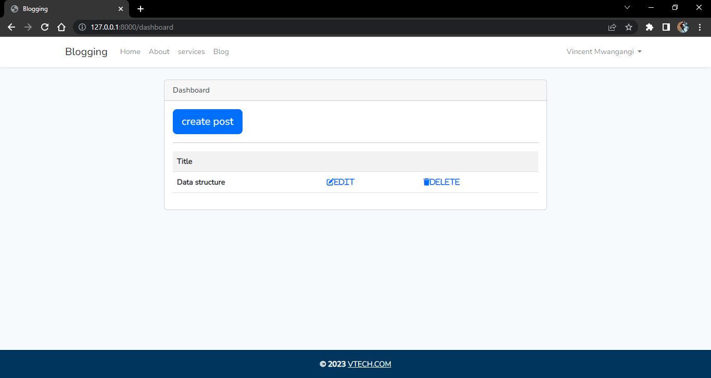

## Blogging Application developed using Laravel 9 

 VtechBlogs is a web Application that is developed using laravel 9 ,Mysql database  

This web Application is responsive in all devices 

#Features 
- user can create account for posting blogs posts
- the user will only be able to edit or delete posts that he/she has created.
-All posts are visible to all user(editors) dashboards .
-The posts contains :
<ul>
<li>Authors name</li>
<li>Date &time it was created </li>
<li>Image (over image) indicating the posts topic(s)</li>
</ul>

# libraries used 

<ul>
<li>Ckeditor for editing posts </li>
<li>Bootstrap 5 for frontent development</li>
<li>Vite </li>
<li>JS </li>

</ul>

